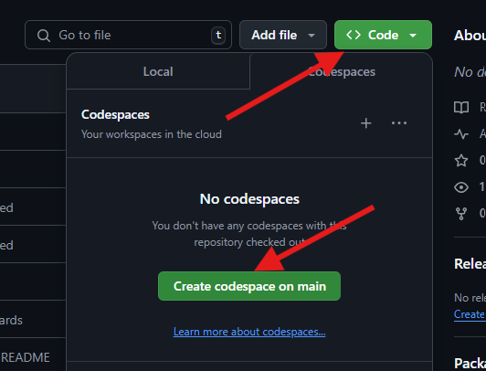

# Interview Task

This repository contains a coding [assignment](./assignment.md) used as part of Omegapoint's recruitment process.

## Getting Started

You may choose one of the programming languages outlined in the technical requirements in the [assignment](./assignment.md). A quick way to get started is by using GitHub Codespaces, a development environment configured with the basic SDK and runtimes required for most languages in a Visual Studio Code editor.

For more information, refer to the [GitHub Codespaces Documentation](https://docs.github.com/en/codespaces/getting-started/quickstart).

If you prefer to use a JetBrains IDE, follow the [setup instructions for using GitHub Codespaces in JetBrains IDE](https://docs.github.com/en/codespaces/developing-in-a-codespace/using-github-codespaces-in-your-jetbrains-ide).

Using a Codespace is NOT a requirement for the assignment, just an optional developer environment.

## Restrictions

- Actions are disabled for the repository
- Issues are disabled for the repository
- No merge's without a pull request and a review can be merged in to main

## LEFT TO DO

Uppdatera programmeringsuppgiften för senior hires <https://github.com/Omegapoint/interview-task>

- Get feedback from OP 
- Update depending on feedback
- Finish script for automated repository creation and user invite  
- Wipe git history or move to new repo

